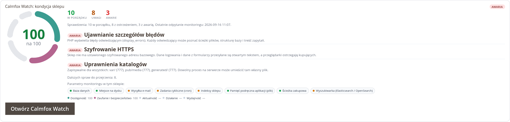
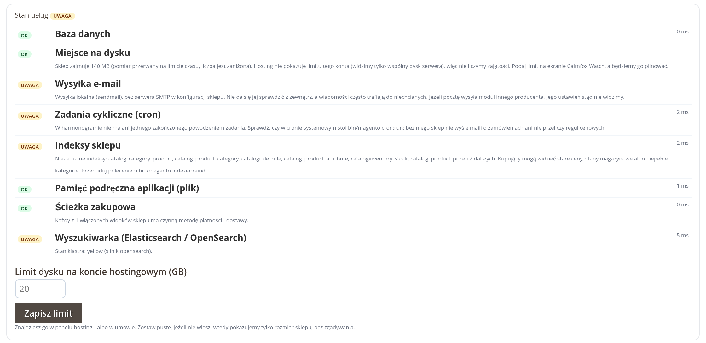
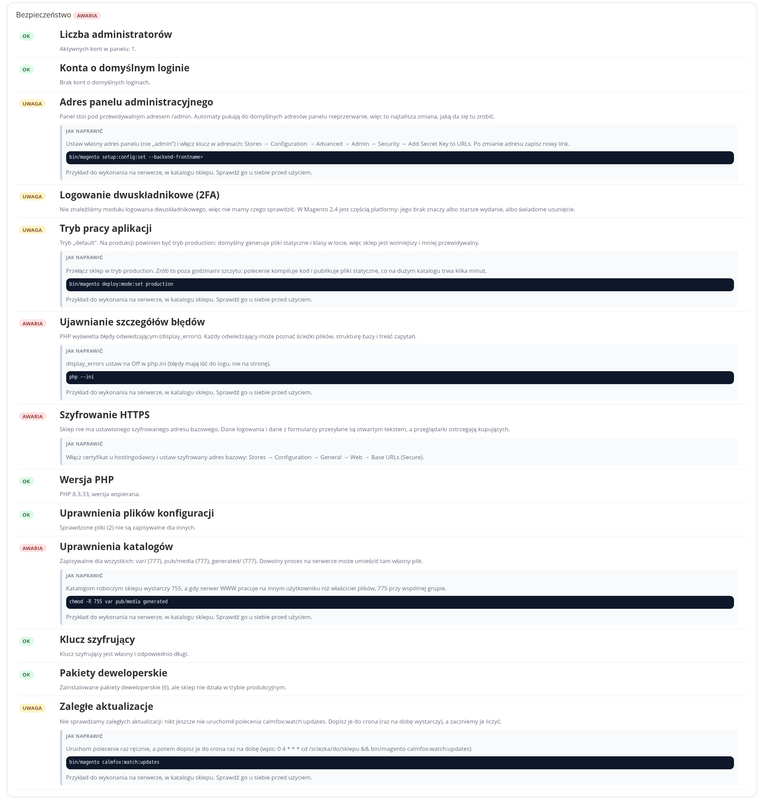

# Calmfox Watch for Magento 2

**English** · [Polski](README.pl.md)

A module that monitors a Magento store from the inside. It exposes a single
secret health endpoint, which Calmfox Watch monitoring polls, and implements
the same contract as the WordPress plugin and the Neos and Sylius packages:
the same response shape, the same signature, the same pairing flow.

The model is "pull": the module sends nothing on its own apart from
registration, pairing and disconnection. Everything else is answers to the
questions monitoring asks.

## Screenshots

The admin UI ships in English and Polish; the screenshots show the Polish one.



*The health tile on the admin dashboard: score ring, check counters and the
three most urgent issues.*



*Service health on the module screen.*



*Security hygiene checks, each with a ready-to-copy fix.*

## Requirements

| Component | Range |
| --- | --- |
| Magento | 2.4.x (Open Source and Adobe Commerce) |
| PHP | 8.1 and above |
| Deploy mode | any, but the security section judges it against production standards |

The module does not require RabbitMQ, Redis or a search engine: it checks what
the store actually has and does not ask about the rest.

## Installation

The module is available in the public Composer package index (Packagist) as
`calmfox/watch-magento`. Where a store cannot use Packagist, it is installed from
the `calmfox-watch-magento.zip` archive provided by the Calmfox Watch panel
(Integrations, the "Download for Magento 2" button). The archive contains a single
directory: `calmfox-watch/`.

### Option 1: Composer (recommended)

```bash
composer require calmfox/watch-magento

bin/magento module:enable Calmfox_Watch
bin/magento setup:upgrade
bin/magento setup:di:compile     # production mode only
bin/magento cache:flush
```

Updating: `composer update calmfox/watch-magento`, then `bin/magento setup:upgrade`
and a cache flush.

### Option 2: the archive in the app/code directory

```bash
mkdir -p app/code/Calmfox
unzip calmfox-watch-magento.zip -d app/code/Calmfox
mv app/code/Calmfox/calmfox-watch app/code/Calmfox/Watch

bin/magento module:enable Calmfox_Watch
bin/magento setup:upgrade
bin/magento setup:di:compile     # production mode only
bin/magento cache:flush
```

The name of the target directory is not arbitrary here. Magento loads the
`app/code/*/*/registration.php` files (the list of patterns lives in
`app/etc/registration_globlist.php`), and the module's `registration.php`
registers it as `Calmfox_Watch`. Composer plays no part at all in this option.

### Option 3: Composer, from the unpacked archive

For deployments where non-core code is supposed to live in `vendor`:

```bash
mkdir -p packages && unzip calmfox-watch-magento.zip -d packages
composer config repositories.calmfox-watch '{"type":"path","url":"./packages/calmfox-watch","options":{"symlink":false}}'
composer require calmfox/watch-magento:@dev

bin/magento module:enable Calmfox_Watch
bin/magento setup:upgrade
bin/magento setup:di:compile     # production mode only
bin/magento cache:flush
```

Three places where it is easy to trip up:

- **`"symlink": false`** tells Composer to copy the files. Without it, the
  directory in `vendor` is nothing but a symlink to `packages` and will vanish
  together with it.
- **The unpacked directory stays in the project** (and in the repository, if
  the deployment runs from git). Composer reads it on every `composer install`,
  so deleting it will break the next deployment.
- **`@dev` after the module name is required.** The archive's `composer.json`
  deliberately has no `version` field (Composer derives the version from the
  repository tag, and the archive has no tag), so a `path` repository reports
  it as `dev-main`.

Updating from the archive: unpack the newer one into the same place (with option 2, replace
the files in `app/code/Calmfox/Watch`), then run `bin/magento setup:upgrade`
and flush the cache.

### The health endpoint must be public

The module adds the `GET /calmfox-watch/health` route. Monitoring polls us, not
the other way round, so there is no session it could present: authorisation is
a secret in the `key` parameter, compared with `hash_equals`.

Storefront routes in Magento are public by nature, so usually there is nothing
to do. Check three things, though, because these are what most often block
the endpoint:

- **The web application firewall (WAF) and web server rules**: an unusual
  path with a long parameter sometimes gets rejected automatically.
- **Full page cache and Varnish**: the response carries a
  `Cache-Control: no-store` header, so neither Magento's built-in cache nor
  the default Varnish configuration will store it. If another caching layer
  sits in front of the store (a CDN, a third-party proxy), exclude the
  `/calmfox-watch/` path from it: monitoring should get the state as of now,
  not as of an hour ago.
- **Maintenance mode**: during a deployment Magento returns 503 for
  everything. That is correct behaviour and monitoring will see it, so it is
  worth scheduling a maintenance window in the Calmfox Watch panel.

The module screen in the Magento admin and the `calmfox:watch:status` command
run a loopback self-check and will say outright if the endpoint is unreachable
from the server itself.

### Connecting to the Calmfox Watch panel

Magento admin: the **Calmfox Watch** item in the main menu bar, right after
the dashboard (the `Calmfox_Watch::watch` permission, so a role without this
resource will not see the screen). The admin dashboard also gets a health
tile: the status, check counts and at most three of the most urgent issues,
with a link to the full screen. The tile is visible only to a role with the
same permission.

Three ways, all ending the same:

1. **Connect via watch.calmfox.net**: we go out to the Calmfox Watch panel,
   you sign in or create an account there, and we come back here with an
   installation key.
2. **The Free plan from the module screen**: you enter an e-mail address and
   the account is created right away.
3. **The command line**, when the deployment is scripted:

```bash
# new account on the Free plan
bin/magento calmfox:watch:register owner@shop.example

# or attach to an existing site in the panel (key from the Integrations screen)
bin/magento calmfox:watch:pair fxp_live_0123456789abcdef
```

The store address is taken from the configuration (`web/secure/base_url`, with
`web/unsecure/base_url` as the fallback), so the commands also work in the CLI,
where there is no HTTP request. Both print the health endpoint they report to
the Calmfox Watch panel, so you can see straight away whether it is correct.

> **Magento admin on a separate domain**: the "Connect via Calmfox Watch"
> button disappears. The return from the Calmfox Watch panel carries the
> installation key in plain form, so we may only return to the Magento admin
> of the domain being connected. With the admin under a different address,
> pairing with a key remains, and it works just the same.

## Configuration

Everything has sensible defaults and there is no separate section in Stores →
Configuration. This is a decision, not an oversight: the API address and the
state directory must be known even when the database does not respond, and
that is exactly the moment monitoring is supposed to be working.

They are changed with an environment variable or an entry in
`app/etc/env.php`:

```php
return [
    // ...
    'calmfox_watch' => [
        // API address. Environment variable: CALMFOX_WATCH_API_URL.
        'api_url' => 'https://watch.calmfox.net',

        // State directory. Environment variable: CALMFOX_WATCH_STATE_DIR.
        // Defaults to var/calmfox-watch.
        'state_dir' => '/var/www/shop/shared/calmfox-watch',

        // Composer command for calmfox:watch:updates.
        'composer_binary' => 'composer',
    ],
];
```

The hosting account's disk limit is set on the module screen in the Magento
admin, because it is the only number the server does not know, while the
customer has it in the contract or in the hosting panel.

## State, the secret and directory-per-release deployments

The state (the health endpoint secret, the pairing marker, the version
history, the computed update counts) lives in a **file**, not in the database
and not in the Magento configuration: `var/calmfox-watch/state.json`,
permissions 600, atomic writes.

There are two reasons and both are practical. The contract one: with the
database down, the health endpoint is supposed to answer `db: fail` with a 503
code, not go silent. The Magento one: `core_config_data` goes through the
configuration cache, which a deployment flushes halfway through its work.

> **Note for "new directory for every release" deployments** (Deployer,
> Capistrano, pipeline deployment, a `current` symlink): the state directory
> MUST be shared between releases. Otherwise every deployment creates a new
> secret, the health endpoint remembered by the Calmfox Watch panel stops
> working and monitoring reports a silent store. The version change history
> also starts from scratch then.
>
> `var/` is usually shared anyway. If it is not, set
> `CALMFOX_WATCH_STATE_DIR=/var/www/shop/shared/calmfox-watch`.

Replacing the secret (the "Replace the key" button) works with a 15-minute
window: the new secret takes effect immediately and the previous one is
honoured for another quarter of an hour, so a failed switch-over in the
Calmfox Watch panel does not break monitoring.

## Scheduled tasks

The module adds one job of its own to the Magento scheduler
(`calmfox_watch_reconcile`, 4:17 at night): a cheap reconciliation of the
package version snapshot, with no network access. Thanks to it, a deployment
made outside the store leaves a trace in the history even when monitoring
happened not to ask for the security section.

Counting pending updates is deliberately not there: it requires Composer and
a trip out to the package repositories, and the store process has no business
going there. It goes into the system cron, next to the actual Magento cron:

```cron
# Magento cron (this is what sends order e-mails and recalculates price rules)
* * * * *  cd /var/www/shop && php bin/magento cron:run >/dev/null 2>&1

# pending package updates for Calmfox Watch (once a day, needs network access)
15 3 * * * cd /var/www/shop && php bin/magento calmfox:watch:updates -q
```

The `magento_cron` check watches the first of these entries: it asks the
Magento scheduler when the last job finished successfully.

## Commands

| Command | What it is for |
| --- | --- |
| `calmfox:watch:status` | Connection state, the health endpoint, both check sections |
| `calmfox:watch:register <email>` | Creates a Free account and connects the store |
| `calmfox:watch:pair [token]` | Connects to an existing site in the Calmfox Watch panel |
| `calmfox:watch:disconnect` | Ends inside monitoring and tells the Calmfox Watch panel about it |
| `calmfox:watch:updates` | Counts pending updates, meant for the system cron |
| `calmfox:watch:health [--section=security]` | Prints the payload locally, with no network access |

Removing the module? Run `calmfox:watch:disconnect` first. Calmfox Watch treats
silence as a signal and will open an incident after three failed polls, so it
is better to tell it outright "I'm done".

## What we check

### The `health` section (monitoring asks every minute)

| Identifier | What it checks |
| --- | --- |
| `db` | A control query over the Magento connection, with timing. No database means `fail`, not an exception. |
| `disk` | Write permission to `var/`, `pub/media` and `generated/`, the installation size, usage against the account limit you entered. |
| `smtp` | A connection to the mail server (TCP, the 220 greeting, EHLO). This is a CONNECTION test, not a delivery test. |
| `magento_cron` | When the last scheduled job finished successfully, how many errors and missed jobs there were in the last 24 hours. |
| `indexers` | Which indexes are out of date. A store with an outdated index works and shows yesterday's prices. |
| `app_cache` | Writing and reading a control key in the application cache, together with the backend name. |
| `checkout` | Whether a purchase is possible in every enabled store view: a payment method (other than Zero Subtotal) and a shipping method. |
| `search_engine` | The state of the Elasticsearch or OpenSearch cluster. In 2.4, search and listings go down without it. |
| `queue` | Backlog in the database queues. Optional: with an empty table (or RabbitMQ) the check is not created at all. |

### The `security` section (monitoring asks once a day)

`admin_count`, `admin_login`, `admin_path`, `two_factor`, `app_mode`,
`debug_display`, `https`, `php_version`, `config_perms`, `dir_perms`,
`crypt_key`, `dev_packages`, `pending_updates`.

Four on this list are Magento-specific: the admin URL together with the secret
key in URLs (`admin_path`), two-factor authentication (`two_factor`), the
deploy mode (`app_mode`) and the encryption key from `app/etc/env.php`, which
encrypts the payment gateway credentials (`crypt_key`).

This is basic hygiene, not an audit. We do not scan for malicious code, we do
not compute checksums of the platform files and we do not make backups.

### What we deliberately do not do

- We do not send a list of packages with versions. `site.updates` is numbers
  only, because an inventory of "what, and in which version" is a ready-made
  map of holes for an attacker. Names travel only where they are the essence
  of the feature: in the version change history and as the set of ENABLED
  modules (`signals.activePlugins`, without versions). That second exception
  is deliberate and has a price: whoever obtains the secret health endpoint
  will see the list of modules. Without names, an event about a disabled
  module would read "something changed", and then there is no way to react
  to it.
- We do not pretend there are automatic updates. Magento has none, so the
  `signals.autoUpdates` field is not sent at all, instead of carrying a value
  that would mean "checked".
- We do not send logins. What travels instead is the number of admin accounts
  and a one-way fingerprint of their set, salted with the installation secret.
  The Calmfox Watch panel detects a CHANGE in the set, not identities.
- We do not look into sales data. The `checkout` check looks only at the
  store view configuration, never at orders or revenue.
- We do not guess numbers we do not know. Until someone has run
  `calmfox:watch:updates`, the `updates` field is not sent at all. Zero would
  mean "checked, nothing to update", and that would be untrue.
- We do not pretend to see mail sent by another vendor's module. We know only
  the `system/smtp` settings, and that is how we describe it.

## Custom checks

Services only the store owner knows about (a warehouse integration, a bridge
to the accounting system, a price synchronisation daemon) are plugged in with
your own class and a single entry in your module's `etc/di.xml`:

```php
namespace Vendor\Shop\Monitoring;

use Calmfox\Watch\Check\HealthCheckInterface;
use Calmfox\Watch\Core\CheckResult;

class WarehouseCheck implements HealthCheckInterface
{
    public function run(): ?CheckResult
    {
        $start = microtime(true);
        $socket = @fsockopen('127.0.0.1', 5672, $errno, $error, 2);
        $ms = (int) round((microtime(true) - $start) * 1000);

        if (!\is_resource($socket)) {
            return CheckResult::fail('warehouse', 'Warehouse integration', 'The service is not accepting connections.', $ms);
        }
        fclose($socket);

        return CheckResult::ok('warehouse', 'Warehouse integration', null, $ms);
    }
}
```

```xml
<virtualType name="Calmfox\Watch\Model\HealthRunner" type="Calmfox\Watch\Check\CheckRunner">
    <arguments>
        <argument name="checks" xsi:type="array">
            <item name="warehouse" xsi:type="object">Vendor\Shop\Monitoring\WarehouseCheck</item>
        </argument>
    </arguments>
</virtualType>
```

The entries are merged with ours, so the above ADDS a check. An entry with a
name we already use overrides ours: that is how you switch off a single check
when it makes no sense in a given store.

Two rules, both from the contract:

1. Return `null` when the check does not apply to this installation. We do not
   send "ok" about something that is not there.
2. Keep a short, hard timeout. The health endpoint answers every minute and
   must not bog the store down.

An identifier from outside the parameter catalogue will reach the Calmfox Watch
panel with the label from the payload and the note "service added by a custom
extension".

## Version change history

Magento has no update hook: modules come in through Composer, usually from
another machine, and `setup:upgrade` only applies database changes. That is
why the module compares snapshots of `vendor/composer/installed.php` (plus the
PHP version) when building the `security` section, in the nightly job and on
`calmfox:watch:updates`.

Consequences you need to know about:

- The `at` timestamp is the **time the change was detected**, not the time of
  the deployment. They usually differ by minutes. For a statement like "the
  outage started after module X was updated" that is enough; for accounting
  for deployments to the second it is not.
- The history starts when the module is installed. Earlier changes cannot be
  reconstructed, because there is nothing to reconstruct them from.
- A change of the release metapackage, `magento/framework` or PHP is recorded
  as `core`, the remaining packages as `plugin`. Magento themes are ordinary
  packages, so they have no separate category. The buffer holds 200 entries.

## Privacy

What travels to Calmfox: the store domain, the e-mail address you provided
(only when creating an account) and the diagnostic data described above: check
statuses with descriptions, the platform and PHP versions, the pending update
counts, the number and fingerprint of admin accounts and the package version
change history. No store content, orders, customer data, logins or passwords.

## Tests

The module's core (`Core/`) is free of Magento: it is plain PHP classes. Thanks
to that, the contract with the Calmfox Watch panel can be tested without a
container, a database or an installed store.

The tests ship their own PSR-4 autoloader (`tests/bootstrap.php`), so the module
needs no `composer install` of its own. Any PHPUnit 10 or later will do:

```bash
phpunit -c phpunit.xml.dist
```

Among other things, the tests guard: the `ok`/`warn`/`fail` aggregation,
rejection of a wrong key, validity of the previous secret within the rotation
window, single use of the connect-via-panel marker, agreement of the signature
with the verification on the Calmfox Watch side, omission of the `updates`
field when there is no data, comparison of version snapshots and parsing of
Magento's mail settings.

Sample responses for both sections live in `docs/sample-health.json` and
`docs/sample-security.json`. They are produced by the same code that answers
monitoring, and a test makes sure they do not drift apart. To regenerate them
after a deliberate contract change:

```bash
CALMFOX_WRITE_SAMPLES=1 phpunit --filter SamplePayloads
```

## Limits of protection

We sign the response with the installation key (HMAC-SHA256 over a nonce, the
generation time and the exact bytes of the body). This cuts off the cheap
attacks: a planted static file, a response served from a cache, a replay from
before the store was taken over. Whoever has full control of the server also
has the secret and can sign a lie. The signature is no substitute for
recovering the server, and that is how we talk about it.

## Licence

MIT, see [LICENSE](LICENSE).
